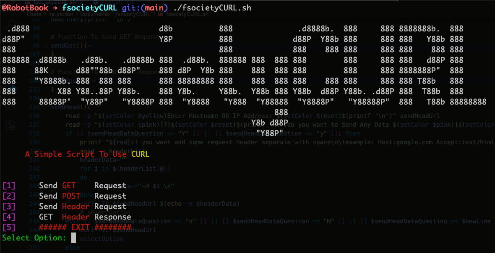

<h1 align="center"> fsocietyCURL <br>

# Description
Simple Script For Use CURL Tool

# Requirements
CURL

# Supported Architectures
| macOS       | GNU / Linux |
| ----------- | ----------|
| ARM         |  ARM      |   
| AMD64       |  AMD64    |


# Cloning the Project
```bash
git clone https://github.com/MrParhamDev/fsocietyCURL.git
```

# Usage
 ```bash
bash fsocietyCURL.sh
 ```

# Help
```bash
fsocietyCURL.sh --help
 ```

